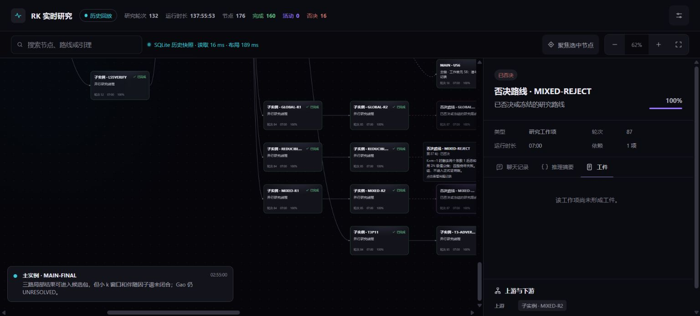

# RBtask × RK／欧拉：Gao 运行记录静态演示

这是与 **RBtask 配套的 RK／欧拉（EULER）一次历史运行记录 Demo**。页面冻结了 Gao 多智能体研究过程，用于展示一项重型研究任务如何经历主实例裁决、子智能体并行、路线分叉、依赖汇合、修复与否决。

## 直接查看

下载 [`index.html`](index.html) 后双击打开即可。它是单文件自包含网页：

- 不需要登录；
- 不需要 RK／欧拉后端；
- 不读取本地 SQLite；
- 不请求外部脚本、样式、字体或图片；
- 页面数据、交互逻辑和样式均已内嵌。

如果浏览器对本地文件施加额外限制，也可以用任意静态文件服务器提供本目录；页面本身仍不依赖服务端接口。

## 本次记录

| 项目 | 数值 |
|---|---:|
| 研究轮次 | 132 |
| 工作节点 | 176 |
| 关系边 | 318 |
| 完成节点 | 160 |
| 否决节点 | 16 |

页面保留节点搜索、缩放、画布拖动、节点选择、聊天记录、推理摘要、工件和上下游关系检查等交互。

## 边界

这是历史快照，不是实时监控页。页面中的“RK 实时研究”沿用当时的界面名称；数据源标识明确显示为“SQLite 历史快照”。本 Demo 不会监听 RBtask、RK、欧拉或 Codex 的当前状态，也不会提交任何命令。

它的用途是给 RBtask 提供一份可视化的运行语境和历史证据样例，而不是替代 RBtask 的冻结题包、验收回执或可复核证书。
